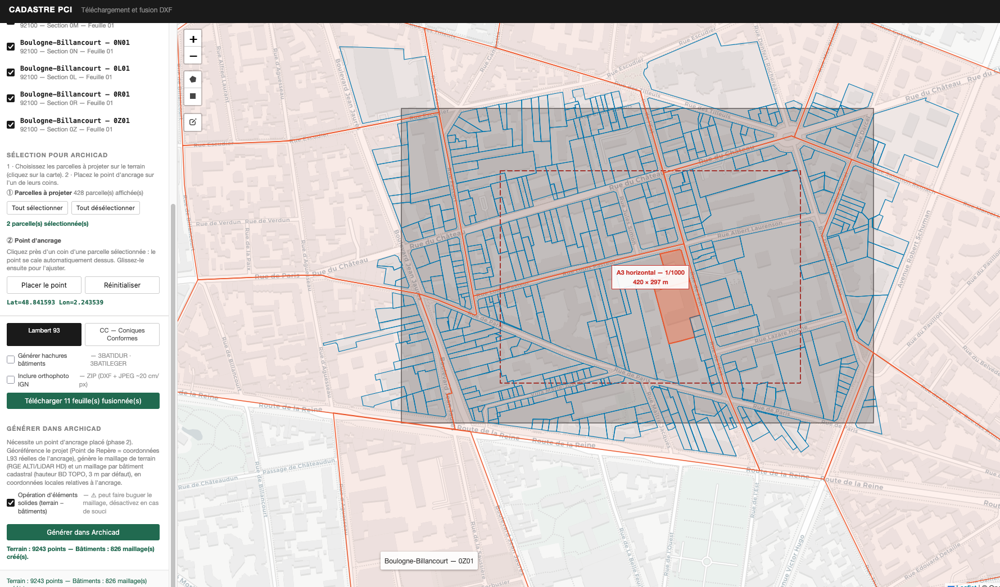
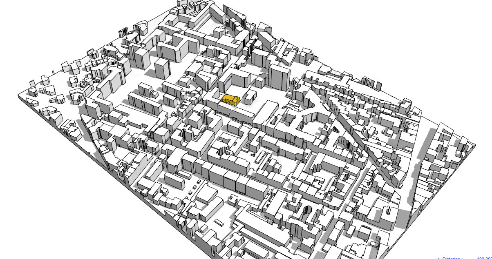

  

# Scripts TAPIR-ARCHICAD

[Français](#français) · [English](#english)

---

## Français

Dépôt regroupant les scripts d'automatisation Archicad (via l'add-on [Tapir](https://github.com/ENZYME-APD/tapir-archicad-automation)) et les outils cadastraux associés, développés pour l'agence.

> ⚠️ **Portée géographique** : ces scripts s'appuient sur des données et API publiques françaises (IGN, BD TOPO, RGE ALTI, cadastre data.gouv.fr) et ne fonctionnent donc, en l'état, que sur le territoire français. Ils peuvent en revanche servir de base pour une adaptation à d'autres pays, à condition de remplacer les sources de données par leurs équivalents locaux.

### Scripts

#### [`SCRIPTS/CONTEXT GENERATOR`](SCRIPTS/CONTEXT%20GENERATOR)

Outil web local (Flask + Leaflet) qui permet de :
- sélectionner un périmètre cadastral sur une carte,
- identifier et télécharger les feuilles PCI (DXF) correspondantes depuis data.gouv.fr,
- générer directement dans Archicad, via Tapir : un maillage de terrain géoréférencé (RGE ALTI/LiDAR HD), les limites de parcelles cadastrales, et les bâtiments existants (hauteur BD TOPO), en coordonnées locales relatives à un point d'ancrage.

Lancement : voir `SCRIPTS/CONTEXT GENERATOR/lancer sous mac os.command` (macOS) ou `lancer sous windows.bat` (Windows). Détails dans `SCRIPTS/CONTEXT GENERATOR/CLAUDE.md`.

| Sélection du périmètre et des parcelles | Résultat dans Archicad (vue 3D) |
|---|---|
|  |  |

---

## English

Repository gathering Archicad automation scripts (via the [Tapir](https://github.com/ENZYME-APD/tapir-archicad-automation) add-on) and related cadastral tools, developed for the agency.

> ⚠️ **Geographic scope**: these scripts rely on French public data and APIs (IGN, BD TOPO, RGE ALTI, data.gouv.fr cadastre) and therefore only work within France as-is. They can, however, serve as a starting point for adapting to other countries, provided the data sources are swapped for local equivalents.

### Scripts

#### [`SCRIPTS/CONTEXT GENERATOR`](SCRIPTS/CONTEXT%20GENERATOR)

Local web tool (Flask + Leaflet) that lets you:
- select a cadastral perimeter on a map,
- identify and download the matching PCI cadastral sheets (DXF) from data.gouv.fr,
- generate directly inside Archicad, via Tapir: a georeferenced terrain mesh (RGE ALTI/LiDAR HD elevation data), cadastral parcel boundaries, and existing buildings (BD TOPO height), all in local coordinates relative to an anchor point.

To launch: see `SCRIPTS/CONTEXT GENERATOR/lancer sous mac os.command` (macOS) or `lancer sous windows.bat` (Windows). Details in `SCRIPTS/CONTEXT GENERATOR/CLAUDE.md`.

| Perimeter and parcel selection | Result in Archicad (3D view) |
|---|---|
|  |  |
